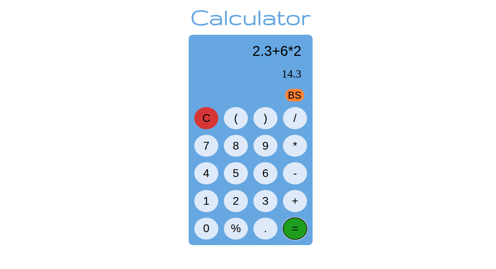

# calculator-web-app

A simple calculator web app.

It supports:

```
+  -> addition

-  -> subtraction

*  -> multiplication

/  -> division

%  -> remainder

() -> bracket expressions
```

---



## Dependencies

- code editor: vs code (vue extension)

- frontend: vue 3, bun

- logic: rust (as wasm pkg using wasm-pack)

## Setup

- clone repo
- cd calculator-web-app
- bun install
- bun dev (for pc)
- bun dev --host (to serve on wifi)
- open browser (http://localhost)
  or
- open mobile browser and type url:
  'http://your-ipv4-address:5173'
