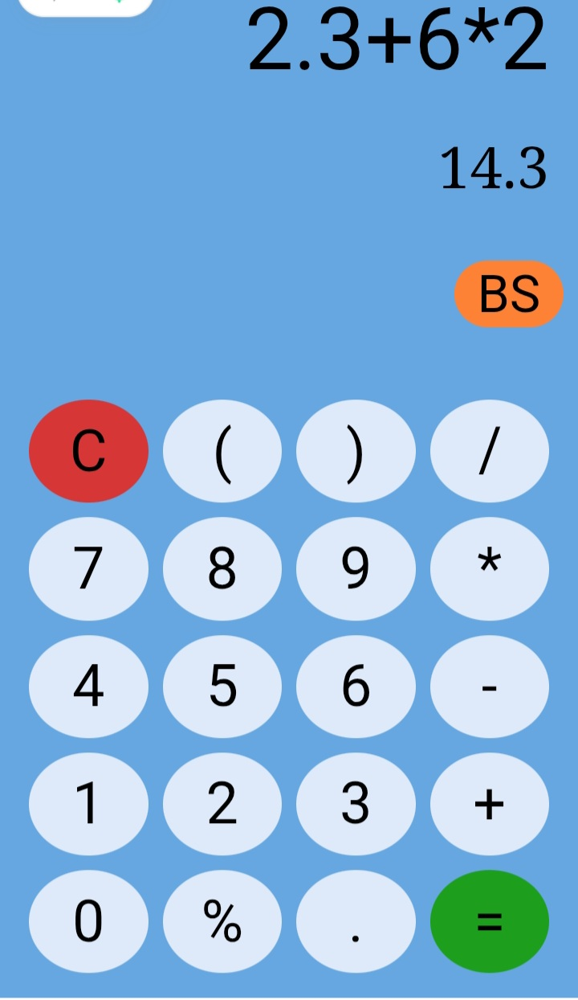

# calculator-web-app

A simple calculator web app.

It supports:

```
+  -> addition

-  -> subtraction

*  -> multiplication

/  -> division

%  -> remainder

() -> bracket expressions
```

---




## Dependencies

- code editor: vs code (vue extension)

- frontend: vue 3, bun

- logic: rust (as wasm pkg using wasm-pack)
